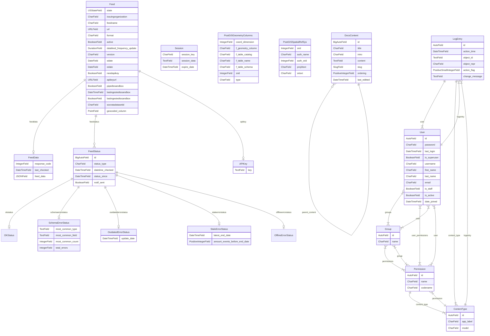

# Entity Relationship Diagram
_As of 8/12/2024_

```mermaid
erDiagram
    LogEntry{
        AutoField id
        DateTimeField action_time
        TextField object_id
        CharField object_repr
        PositiveSmallIntegerField action_flag
        TextField change_message
    }
    Permission{
        AutoField id
        CharField name
        CharField codename
    }
    Group{
        AutoField id
        CharField name
    }
    User{
        AutoField id
        CharField password
        DateTimeField last_login
        BooleanField is_superuser
        CharField username
        CharField first_name
        CharField last_name
        CharField email
        BooleanField is_staff
        BooleanField is_active
        DateTimeField date_joined
    }
    ContentType{
        AutoField id
        CharField app_label
        CharField model
    }
    Session{
        CharField session_key
        TextField session_data
        DateTimeField expire_date
    }

    PostGISGeometryColumns {
        IntegerField coord_dimension
        CharField f_geometry_column
        CharField f_table_catalog
        CharField f_table_name
        CharField f_table_schema
        IntegerField srid
        CharField type
    }

    PostGISSpatialRefSys {
        IntegerField srid
        CharField auth_name
        IntegerField auth_srid
        CharField proj4text
        CharField srtext
    }

    DocsContent {
        BigAutoField id
        CharField title
        CharField intro
        TextField content
        SlugField slug
        PositiveIntegerField ordering
        DateTimeField last_editted
    }

    Feed {
        USStateField state
        CharField issuingorganization
        CharField feedname
        URLField url
        CharField format
        BooleanField active
        DurationField datafeed_frequency_update
        CharField version
        DateField sdate
        DateField edate
        BooleanField needapikey
        URLField apikeyurl
        BooleanField pipedtosandbox
        DateTimeField lastingestedtosandbox
        BooleanField lastingestedtosandbox
        CharField socratadatasetid
        PointField geocoded_column
    }

    FeedData {
        IntegerField response_code
        DateTimeField last_checked
        JSONField feed_data
    }

    FeedStatus {
        BigAutoField id
        CharField status_type
        DateTimeField datetime_checked
        DateTimeField status_since
        BooleanField notif_sent
    }

    OKStatus {

    }

    SchemaErrorStatus {
        TextField most_common_type
        TextField most_common_field
        IntegerField most_common_count
        IntegerField total_errors
    }

    OutdatedErrorStatus {
        DateTimeField update_date
    }

    StaleErrorStatus {
        DateTimeField latest_end_date
        PositiveIntegerField amount_events_before_end_date
    }

    OfflineErrorStatus {

    }

    APIKey {
        TextField key
    }


    LogEntry||--|{User : user
    LogEntry||--|{ContentType : content_type
    Permission}|--|{Group : group
    Permission}|--|{User : user
    Permission||--|{ContentType : content_type
    Group}|--|{User : user
    Group}|--|{Permission : permissions
    User||--|{LogEntry : logentry
    User}|--|{Group : groups
    User}|--|{Permission : user_permissions
    ContentType||--|{LogEntry : logentry
    ContentType||--|{Permission : permission
    DocsContent}o--||DocsContent : parent_content
    Feed||--o|FeedData : feeddata
    Feed||--o{FeedStatus : feedstatus
    FeedStatus||--o|OKStatus : okstatus
    FeedStatus||--o|SchemaErrorStatus : schemaerrorstatus
    FeedStatus||--o|OutdatedErrorStatus : outdatederrorstatus
    FeedStatus||--o|StaleErrorStatus : staleerrorstatus
    FeedStatus||--o|OfflineErrorStatus : offlineerrorstatus
    Feed||--o|APIKey : apikey
```
