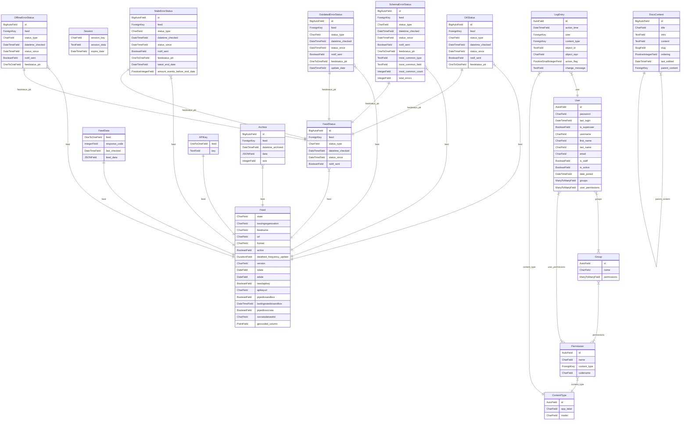

# Entity Relationship Diagram
_As of 1/8/2025_

```mermaid
erDiagram
LogEntry {
    AutoField id
    DateTimeField action_time
    ForeignKey user
    ForeignKey content_type
    TextField object_id
    CharField object_repr
    PositiveSmallIntegerField action_flag
    TextField change_message
}
Permission {
    AutoField id
    CharField name
    ForeignKey content_type
    CharField codename
}
Group {
    AutoField id
    CharField name
    ManyToManyField permissions
}
User {
    AutoField id
    CharField password
    DateTimeField last_login
    BooleanField is_superuser
    CharField username
    CharField first_name
    CharField last_name
    CharField email
    BooleanField is_staff
    BooleanField is_active
    DateTimeField date_joined
    ManyToManyField groups
    ManyToManyField user_permissions
}
ContentType {
    AutoField id
    CharField app_label
    CharField model
}
Session {
    CharField session_key
    TextField session_data
    DateTimeField expire_date
}
DocsContent {
    BigAutoField id
    CharField title
    TextField intro
    TextField content
    SlugField slug
    PositiveIntegerField ordering
    DateTimeField last_editted
    ForeignKey parent_content
}
Feed {
    CharField state
    CharField issuingorganization
    CharField feedname
    CharField url
    CharField format
    BooleanField active
    DurationField datafeed_frequency_update
    CharField version
    DateField sdate
    DateField edate
    BooleanField needapikey
    CharField apikeyurl
    BooleanField pipedtosandbox
    DateTimeField lastingestedtosandbox
    BooleanField pipedtosocrata
    CharField socratadatasetid
    PointField geocoded_column
}
FeedData {
    OneToOneField feed
    IntegerField response_code
    DateTimeField last_checked
    JSONField feed_data
}
FeedStatus {
    BigAutoField id
    ForeignKey feed
    CharField status_type
    DateTimeField datetime_checked
    DateTimeField status_since
    BooleanField notif_sent
}
OKStatus {
    BigAutoField id
    ForeignKey feed
    CharField status_type
    DateTimeField datetime_checked
    DateTimeField status_since
    BooleanField notif_sent
    OneToOneField feedstatus_ptr
}
SchemaErrorStatus {
    BigAutoField id
    ForeignKey feed
    CharField status_type
    DateTimeField datetime_checked
    DateTimeField status_since
    BooleanField notif_sent
    OneToOneField feedstatus_ptr
    TextField most_common_type
    TextField most_common_field
    IntegerField most_common_count
    IntegerField total_errors
}
OutdatedErrorStatus {
    BigAutoField id
    ForeignKey feed
    CharField status_type
    DateTimeField datetime_checked
    DateTimeField status_since
    BooleanField notif_sent
    OneToOneField feedstatus_ptr
    DateTimeField update_date
}
StaleErrorStatus {
    BigAutoField id
    ForeignKey feed
    CharField status_type
    DateTimeField datetime_checked
    DateTimeField status_since
    BooleanField notif_sent
    OneToOneField feedstatus_ptr
    DateTimeField latest_end_date
    PositiveIntegerField amount_events_before_end_date
}
OfflineErrorStatus {
    BigAutoField id
    ForeignKey feed
    CharField status_type
    DateTimeField datetime_checked
    DateTimeField status_since
    BooleanField notif_sent
    OneToOneField feedstatus_ptr
}
APIKey {
    OneToOneField feed
    TextField key
}
Archive {
    BigAutoField id
    ForeignKey feed
    DateTimeField datetime_archived
    JSONField data
    IntegerField size
}
LogEntry }|--|| User : user
LogEntry }|--|| ContentType : content_type
Permission }|--|| ContentType : content_type
Group }|--|{ Permission : permissions
User }|--|{ Group : groups
User }|--|{ Permission : user_permissions
DocsContent }|--|| DocsContent : parent_content
FeedData ||--|| Feed : feed
FeedStatus }|--|| Feed : feed
OKStatus }|--|| Feed : feed
OKStatus ||--|| FeedStatus : feedstatus_ptr
SchemaErrorStatus }|--|| Feed : feed
SchemaErrorStatus ||--|| FeedStatus : feedstatus_ptr
OutdatedErrorStatus }|--|| Feed : feed
OutdatedErrorStatus ||--|| FeedStatus : feedstatus_ptr
StaleErrorStatus }|--|| Feed : feed
StaleErrorStatus ||--|| FeedStatus : feedstatus_ptr
OfflineErrorStatus }|--|| Feed : feed
OfflineErrorStatus ||--|| FeedStatus : feedstatus_ptr
APIKey ||--|| Feed : feed
Archive }|--|| Feed : feed
```
